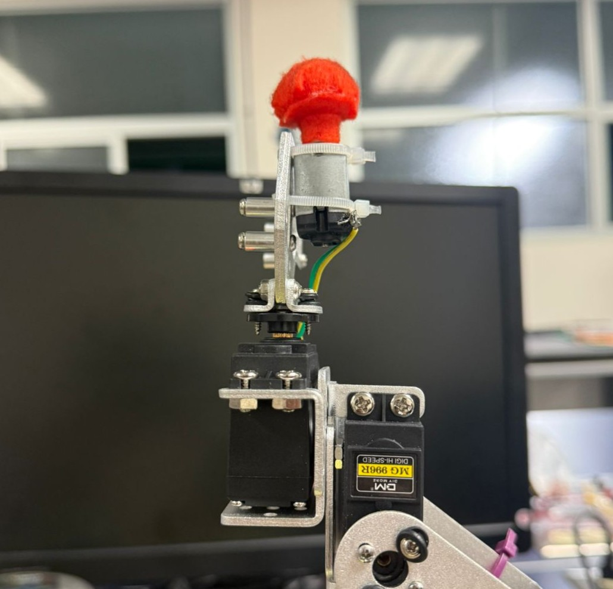

# Proyecto final de robótica – Escuela Mecatrónica

## Brazo robótico de 5 GDL para pulir

Este repositorio recopila toda la información para lograr el desarrollo de un brazo robótico para “pulir” un cuadrado de marcador en una pizarra acrílica. Este proyecto tiene un problema del ámbito industrial con una solución académica, debido a la dificultad de realizar el robot real para solucionar la problemática.

Para el diseño mecánico utilizamos el robot [DIYMORE ROT3U](https://a.co/d/jFZi6J7), lo cual nos facilita el comienzo del proyecto, por lo que tenemos que centrarnos en la herramienta, las trayectorias y las cinemáticas del robot.

La herramienta, claramente, no nos funciona para pulir, por lo que por medio de Fusion360 se realizó un acople para un motor DC de 5V (Se adjunta el `.stl`) que seguidamente se imprimió en 3D. Con ayuda de una felpa se le da una mejor textura para el pulido.

Para el control del robot se usa un [XIAO ESP32 C3](https://wiki.seeedstudio.com/XIAO_ESP32C3_Getting_Started/) con un driver [PCA9685](https://www.alldatasheet.com/html-pdf/293576/NXP/PCA9685/54/1/PCA9685.html). De esta manera el microcontrolador no debe de tener muchos pines digitales que generen PWM. Por otra parte, la sección de potencia se realiza con una fuente regulable de potencia. Para comprender las conexiones y demás, se tiene la siguiente arquitectura:

Para hacer funcionar el robot, primero se debe de compilar el [archivo .ino](./ConexionMatlab.ino) llamado `ConexionMatlab`, para que el Arduino por el puerto serial esté esperando constantemente los ángulos que envía el código de Matlab. En el caso de Matlab, se deben de tener todos los códigos en una misma carpeta para que se puedan llamar entre ellos. 

Se utiliza cinemática directa, inversa y seguidamente se le dan puntos con trayectoria de polinomios cúbicos para realizar los barridos en el pulido. El código `main` es [Proyecto_Brazo_Pulidor.m](./Proyecto_Brazo_Pulidor.m), a partir de este tenemos un brazo de pulido funcional. En este código no se contemplan todos los cálculos en sí, pero para entender dicho desgloce, pero en el archivo `informe_final.pdf` se puede ver la explicación de todos los cálculos necesarios que respaldan dicho código.

---

### Cualquier duda, consultar con:
- Kaleb Granados: [kalebgranac13@gmail.com](mailto:kalebgranac13@gmail.com)  
- Marco Flores [marflo73@gmail.com](mailto:marflo73@gmail.com)   
- Gregory Jiménez: [gregoryjime28@gmail.com](mailto:gregoryjime28@gmail.com)
